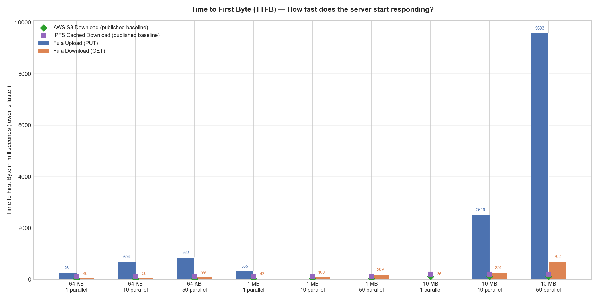
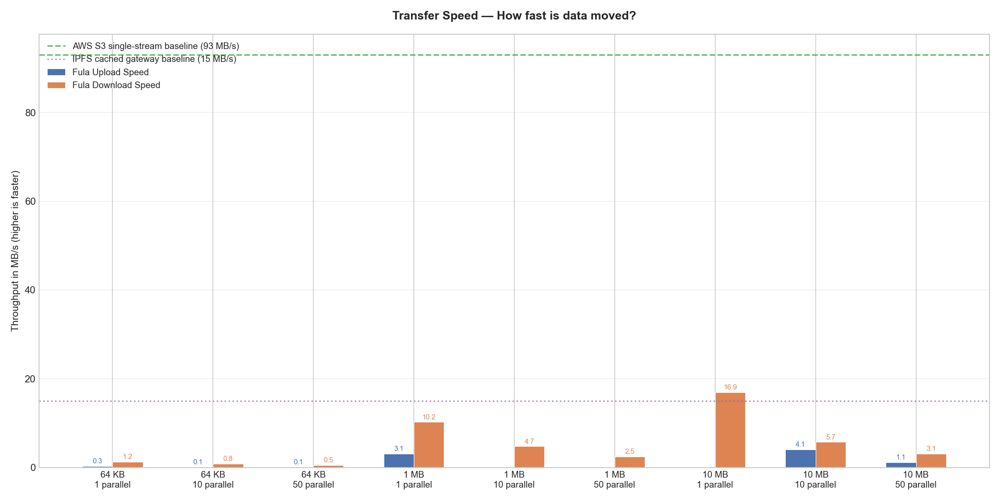
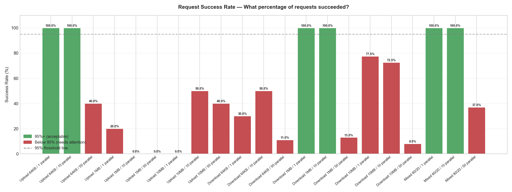
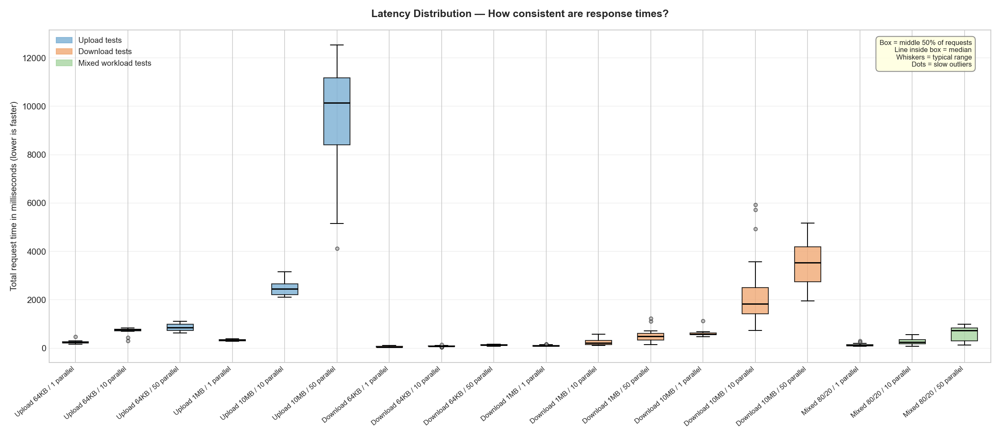

# Fula S3 Gateway — Performance Benchmark Report

This report measures how fast the Fula decentralized storage gateway responds to standard S3 (upload/download) requests. It tests different file sizes and levels of simultaneous traffic, then compares the results against published numbers from AWS S3, IPFS public gateways, and Cloudflare R2.

## How to Read This Report

| Term | What It Means |
|------|---------------|
| **TTFB** (Time to First Byte) | How long until the server *starts* responding. Lower = faster. Measured in milliseconds (ms). |
| **Throughput** | How much data is transferred per second. Measured in megabytes per second (MB/s). Higher = faster. |
| **Latency** | Total time for the entire request to complete (upload or download finished). Measured in ms. Lower = faster. |
| **p50 / p90 / p95 / p99** | Percentile values. p50 = the median (half of requests were faster). p99 = 99% of requests were faster than this value (the slow outliers). |
| **Parallel requests** | How many requests run at the same time. "1" means one-at-a-time (sequential). "50" means 50 simultaneous requests hitting the server. |
| **Success Rate** | Percentage of requests that completed without error. 95%+ is considered acceptable; 99%+ is excellent. |
| **Upload / Download** | Upload = writing a file to storage (PUT). Download = reading a file back (GET). |
| **Mixed 80/20** | A realistic workload: 80% of operations are downloads (reads) and 20% are uploads (writes). |

## Test Configuration

| Setting | Value |
|---------|-------|
| Endpoint tested | `https://s3.cloud.fx.land` |
| Bucket name | `benchmark` |
| Date / time (UTC) | 2026-02-09 16:27:40 |
| Machine | Windows-11-10.0.26200-SP0 |
| Python version | 3.12.10 |
| File sizes tested | 64 KB, 1 MB, 10 MB |
| Parallel request levels | 1 (sequential), 10, and 50 |
| Mixed workload ratio | 80% downloads / 20% uploads |

## Results at a Glance

Each row is one test scenario. "TTFB" columns show how fast the server started responding; "Throughput" shows the average transfer speed.

| Scenario | Requests | Success Rate | Avg TTFB | Median (p50) | p90 | p95 | p99 | Avg Throughput |
|----------|----------|--------------|----------|--------------|-----|-----|-----|----------------|
| Upload 64KB / 1 parallel | 10 | 100.0% | 261 ms | 242 ms | 314 ms | 392 ms | 454 ms | 0.26 MB/s |
| Upload 64KB / 10 parallel | 10 | 100.0% | 694 ms | 774 ms | 816 ms | 830 ms | 841 ms | 0.10 MB/s |
| Upload 64KB / 50 parallel | 50 | 40.0% | 862 ms | 859 ms | 1031 ms | 1035 ms | 1095 ms | 0.07 MB/s |
| Upload 1MB / 1 parallel | 10 | 20.0% | 335 ms | 335 ms | 379 ms | 385 ms | 389 ms | 3.06 MB/s |
| Upload 1MB / 10 parallel | 10 | 0.0% | 0 ms | 0 ms | 0 ms | 0 ms | 0 ms | 0.00 MB/s |
| Upload 1MB / 50 parallel | 50 | 0.0% | 0 ms | 0 ms | 0 ms | 0 ms | 0 ms | 0.00 MB/s |
| Upload 10MB / 1 parallel | 10 | 0.0% | 0 ms | 0 ms | 0 ms | 0 ms | 0 ms | 0.00 MB/s |
| Upload 10MB / 10 parallel | 10 | 50.0% | 2519 ms | 2453 ms | 2957 ms | 3057 ms | 3137 ms | 4.05 MB/s |
| Upload 10MB / 50 parallel | 50 | 40.0% | 9593 ms | 10141 ms | 11997 ms | 12264 ms | 12478 ms | 1.13 MB/s |
| Download 64KB / 1 parallel | 40 | 30.0% | 48 ms | 46 ms | 75 ms | 92 ms | 106 ms | 1.23 MB/s |
| Download 64KB / 10 parallel | 40 | 50.0% | 56 ms | 54 ms | 78 ms | 78 ms | 78 ms | 0.80 MB/s |
| Download 64KB / 50 parallel | 200 | 11.0% | 99 ms | 101 ms | 125 ms | 125 ms | 125 ms | 0.51 MB/s |
| Download 1MB / 1 parallel | 40 | 100.0% | 42 ms | 39 ms | 47 ms | 63 ms | 97 ms | 10.22 MB/s |
| Download 1MB / 10 parallel | 40 | 100.0% | 100 ms | 94 ms | 158 ms | 219 ms | 238 ms | 4.74 MB/s |
| Download 1MB / 50 parallel | 200 | 13.0% | 209 ms | 203 ms | 329 ms | 344 ms | 355 ms | 2.45 MB/s |
| Download 10MB / 1 parallel | 40 | 77.5% | 36 ms | 32 ms | 47 ms | 47 ms | 57 ms | 16.92 MB/s |
| Download 10MB / 10 parallel | 40 | 72.5% | 274 ms | 94 ms | 700 ms | 778 ms | 943 ms | 5.69 MB/s |
| Download 10MB / 50 parallel | 200 | 8.0% | 702 ms | 782 ms | 1391 ms | 1535 ms | 1695 ms | 3.11 MB/s |
| Mixed 80/20 / 1 parallel | 100 | 100.0% | 61 ms | 31 ms | 158 ms | 173 ms | 251 ms | 8.46 MB/s |
| Mixed 80/20 / 10 parallel | 100 | 100.0% | 134 ms | 78 ms | 390 ms | 422 ms | 501 ms | 4.57 MB/s |
| Mixed 80/20 / 50 parallel | 100 | 37.0% | 383 ms | 375 ms | 794 ms | 843 ms | 923 ms | 2.50 MB/s |

## Upload Performance (Write Benchmark)

Measures how fast files can be uploaded to storage. Each file is filled with random bytes to prevent deduplication.

| Scenario | Requests | Success Rate | Avg TTFB | Median TTFB | p90 TTFB | p99 TTFB | Avg Total Latency | Avg Throughput |
|----------|----------|--------------|----------|-------------|----------|----------|-------------------|----------------|
| Upload 64KB / 1 parallel | 10 | 100.0% | 261 ms | 242 ms | 314 ms | 454 ms | 261 ms | 0.26 MB/s |
| Upload 64KB / 10 parallel | 10 | 100.0% | 694 ms | 774 ms | 816 ms | 841 ms | 694 ms | 0.10 MB/s |
| Upload 64KB / 50 parallel | 50 | 40.0% | 862 ms | 859 ms | 1031 ms | 1095 ms | 862 ms | 0.07 MB/s |
| Upload 1MB / 1 parallel | 10 | 20.0% | 335 ms | 335 ms | 379 ms | 389 ms | 335 ms | 3.06 MB/s |
| Upload 1MB / 10 parallel | 10 | 0.0% | 0 ms | 0 ms | 0 ms | 0 ms | 0 ms | 0.00 MB/s |
| Upload 1MB / 50 parallel | 50 | 0.0% | 0 ms | 0 ms | 0 ms | 0 ms | 0 ms | 0.00 MB/s |
| Upload 10MB / 1 parallel | 10 | 0.0% | 0 ms | 0 ms | 0 ms | 0 ms | 0 ms | 0.00 MB/s |
| Upload 10MB / 10 parallel | 10 | 50.0% | 2519 ms | 2453 ms | 2957 ms | 3137 ms | 2519 ms | 4.05 MB/s |
| Upload 10MB / 50 parallel | 50 | 40.0% | 9593 ms | 10141 ms | 11997 ms | 12478 ms | 9593 ms | 1.13 MB/s |

## Download Performance (Read Benchmark)

Measures how fast previously-uploaded files can be downloaded back. Each request downloads a complete file and verifies the response.

| Scenario | Requests | Success Rate | Avg TTFB | Median TTFB | p90 TTFB | p99 TTFB | Avg Total Latency | Avg Throughput |
|----------|----------|--------------|----------|-------------|----------|----------|-------------------|----------------|
| Download 64KB / 1 parallel | 40 | 30.0% | 48 ms | 46 ms | 75 ms | 106 ms | 62 ms | 1.23 MB/s |
| Download 64KB / 10 parallel | 40 | 50.0% | 56 ms | 54 ms | 78 ms | 78 ms | 86 ms | 0.80 MB/s |
| Download 64KB / 50 parallel | 200 | 11.0% | 99 ms | 101 ms | 125 ms | 125 ms | 129 ms | 0.51 MB/s |
| Download 1MB / 1 parallel | 40 | 100.0% | 42 ms | 39 ms | 47 ms | 97 ms | 103 ms | 10.22 MB/s |
| Download 1MB / 10 parallel | 40 | 100.0% | 100 ms | 94 ms | 158 ms | 238 ms | 269 ms | 4.74 MB/s |
| Download 1MB / 50 parallel | 200 | 13.0% | 209 ms | 203 ms | 329 ms | 355 ms | 516 ms | 2.45 MB/s |
| Download 10MB / 1 parallel | 40 | 77.5% | 36 ms | 32 ms | 47 ms | 57 ms | 604 ms | 16.92 MB/s |
| Download 10MB / 10 parallel | 40 | 72.5% | 274 ms | 94 ms | 700 ms | 943 ms | 2252 ms | 5.69 MB/s |
| Download 10MB / 50 parallel | 200 | 8.0% | 702 ms | 782 ms | 1391 ms | 1695 ms | 3473 ms | 3.11 MB/s |

## Mixed Workload (Realistic Traffic)

Simulates realistic traffic: 80% of operations are downloads and 20% are uploads, using 1 MB files. This models a typical application where users read data more often than they write.

| Scenario | Requests | Success Rate | Avg TTFB | Median TTFB | p90 TTFB | p99 TTFB | Avg Total Latency | Avg Throughput |
|----------|----------|--------------|----------|-------------|----------|----------|-------------------|----------------|
| Mixed 80/20 / 1 parallel | 100 | 100.0% | 61 ms | 31 ms | 158 ms | 251 ms | 127 ms | 8.46 MB/s |
| Mixed 80/20 / 10 parallel | 100 | 100.0% | 134 ms | 78 ms | 390 ms | 501 ms | 264 ms | 4.57 MB/s |
| Mixed 80/20 / 50 parallel | 100 | 37.0% | 383 ms | 375 ms | 794 ms | 923 ms | 608 ms | 2.50 MB/s |

## How Does Fula Compare to the Industry?

The table below compares Fula's median (p50) TTFB against published benchmarks from other storage services. Fula is a **decentralized** storage network backed by IPFS, so it is most fairly compared against other IPFS-based systems. AWS S3 and Cloudflare R2 are included as centralized baselines for reference.

> **Important context:** AWS S3 numbers are typically measured from EC2 instances in the *same data center*. Fula routes through a decentralized network, so higher latency is expected. The key comparison is against IPFS gateways.

### Download (GET) — Median TTFB at 1 parallel request

| Service | 64 KB | 1 MB | 10 MB | Source |
|---------|-------|------|-------|--------|
| **Fula S3 Gateway** | **46 ms** | **39 ms** | **32 ms** | This benchmark |
| AWS S3 | 25 ms | 40 ms | 115 ms | AWS docs, dvassallo, graykode |
| IPFS Gateway (cached) | 100 ms | 120 ms | 200 ms | Cloudflare blog, IPFS gateway research |
| IPFS (uncached) | 5000 ms | 10000 ms | 30000 ms | Cloudflare IPFS measurements |
| Cloudflare R2 | 65 ms | 80 ms | 250 ms | kerkour.com, Tigris Data |

### Upload (PUT) — Median TTFB at 1 parallel request

| Service | 64 KB | 1 MB | 10 MB | Source |
|---------|-------|------|-------|--------|
| **Fula S3 Gateway** | **242 ms** | **335 ms** | **0 ms** | This benchmark |
| AWS S3 | 50 ms | 70 ms | 190 ms | AWS docs, dvassallo, graykode |
| IPFS Gateway (cached) | n/a | n/a | n/a | Cloudflare blog, IPFS gateway research |
| IPFS (uncached) | 1300 ms | 2000 ms | 5000 ms | Cloudflare IPFS measurements |
| Cloudflare R2 | 200 ms | 250 ms | 400 ms | kerkour.com, Tigris Data |

### Throughput — Single-stream average

| Service | Avg Throughput (MB/s) | Source |
|---------|----------------------|--------|
| **Fula S3 Gateway** | **9.5** | This benchmark |
| AWS S3 | 93 | AWS docs, dvassallo, graykode |
| IPFS Gateway (cached) | 15 | Cloudflare blog, IPFS gateway research |
| IPFS (uncached) | 5 | Cloudflare IPFS measurements |
| Cloudflare R2 | 30 | kerkour.com, Tigris Data |

## Charts

### Time to First Byte (TTFB) — Upload vs Download

### Throughput — Upload vs Download Speed

### Success Rate — Did Requests Complete Without Error?

### Latency Distribution — How Consistent Are Response Times?

## Error Summary

The table below shows how many requests failed and why. Occasional errors are normal for any network service.

| Error Type | Count | Explanation |
|------------|-------|-------------|
| Client Error (4xx) | 12 | The request was rejected (e.g., authentication issue, missing resource, bad request format). |
| Server Error (5xx) | 7 | The server encountered an internal error. Typically transient; retrying usually succeeds. |

## Conclusion

**Total requests made:** 1350  
**Overall success rate:** 40.0%

### Verdict

- FAIL — Reliability below target: 40.0% success rate (target: >= 95%)
- PASS — Fast downloads: average TTFB 174 ms (competitive with cached IPFS gateways at ~100-120 ms)
- PASS — Acceptable uploads: average TTFB 2377 ms (much faster than standard IPFS DHT provide at 30,000+ ms)

## Industry Benchmark Sources

The industry comparison numbers used in this report come from the following publicly available sources:

- **AWS S3**: [AWS S3 Performance Best Practices](https://docs.aws.amazon.com/AmazonS3/latest/userguide/optimizing-performance.html), [dvassallo/s3-benchmark](https://github.com/dvassallo/s3-benchmark), [graykode/s3-latency](https://github.com/graykode/s3-latency)
- **IPFS (cached)**: [Cloudflare IPFS Measurements](https://blog.cloudflare.com/ipfs-measurements/), [IPFS Gateway Research](https://github.com/maxim-saplin/ipfs_gateway_research)
- **IPFS (uncached)**: [Cloudflare IPFS Measurements](https://blog.cloudflare.com/ipfs-measurements/) (average 44s for newly-created uncached content)
- **Cloudflare R2**: [kerkour.com S3 vs R2](https://kerkour.com/aws-s3-vs-cloudflare-r2-price-performance-user-experience), [Tigris Data Benchmark](https://www.tigrisdata.com/blog/benchmark-small-objects/)

---
*Generated by `benchmark_s3.py` on 2026-02-09 16:27:40 UTC*
